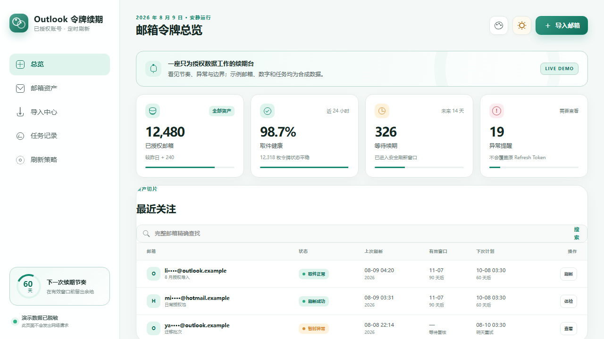

# TokenLoom / 令牌织机 — Outlook OAuth Token Renewal

[](https://github.com/ferretgeek/TokenLoom/actions/workflows/ci.yml)
[](https://github.com/ferretgeek/TokenLoom/actions/workflows/codeql.yml)
[](https://github.com/ferretgeek/TokenLoom/releases)
[](LICENSE)

> Weave authorized token renewal, health checks, and exceptions into one visible rhythm.

[](https://ferretgeek.github.io/TokenLoom/)

[Live demo](https://ferretgeek.github.io/TokenLoom/) · [中文](README.md) · [Deployment](docs/DEPLOYMENT_EN.md) · [Security](SECURITY.md)

TokenLoom is a self-hosted console for managing user-authorized Microsoft Outlook / Hotmail OAuth2 refresh tokens. It neither supplies accounts or tokens nor bypasses Microsoft authorization, risk controls, or terms.

## What it does

- Streams pasted or TXT imports into durable PostgreSQL jobs that survive worker restarts.
- Renews one, selected, due, or snapshotted account ranges and runs read-only IMAP XOAUTH2 health checks.
- Immediately discards the legacy password field; encrypts email, Client ID, and Refresh Token with AES-256-GCM; exposes masked addresses only.
- Uses fixed Microsoft OAuth and IMAP destinations, bounded response and input sizes, keyset pagination, batch processing, disk headroom, and retention cleanup.
- Provides jade, sky, sunset, and exact `#17191d` graphite themes, persisted globally across login and console views.

## Local QA

Python 3.11+ is required:

```powershell
python -m venv .venv
.\.venv\Scripts\python -m pip install -r requirements-dev.txt
.\.venv\Scripts\python scripts\run_qa.py
```

Open `http://127.0.0.1:8787/`. The temporary admin key is written only to the ignored `data/qa-*-admin-key.txt` path. Stop and clean the local run with:

```powershell
.\.venv\Scripts\python scripts\stop_qa.py
.\.venv\Scripts\python scripts\cleanup_qa.py
```

## Docker Compose

Generate secrets on a trusted machine, then start the loopback-bound web app, worker, and PostgreSQL services:

```powershell
.\.venv\Scripts\python scripts\generate_admin_key.py --output .\admin-key.txt
.\.venv\Scripts\python scripts\generate_docker_env.py --admin-key-file .\admin-key.txt --output .env
docker compose up -d --build
```

Visit `http://127.0.0.1:8787/`. A public deployment must sit behind a trusted HTTPS reverse proxy and set `COOKIE_SECURE`, `TRUST_PROXY_HEADERS`, `TRUSTED_PROXY_IPS`, and `ALLOWED_HOSTS` explicitly. See [Deployment](docs/DEPLOYMENT_EN.md) for Docker and Ubuntu systemd instructions.

## Security boundary

TokenLoom reduces exposure from a database-only leak, but it cannot protect data after the host or application process is compromised. Keep the field-encryption key separate from database backups, use one worker, rotate the session secret to revoke every session, and never put production data in tests or screenshots.

Use the project only for accounts and tokens you own or are explicitly authorized to administer. TokenLoom is independent of and not endorsed by Microsoft.

## Quality gate

```powershell
.\.venv\Scripts\python -m ruff format --check app scripts tests
.\.venv\Scripts\python -m ruff check app scripts tests
.\.venv\Scripts\python -m pytest -q
.\.venv\Scripts\python -m pip_audit -r requirements.txt --progress-spinner off
```

See [Privacy](PRIVACY.md), [Architecture](docs/ARCHITECTURE.md), and [Security](SECURITY.md) for the exact data and operational boundaries.

## License

[MIT](LICENSE). Direct dependency licenses are summarized in [THIRD_PARTY.md](THIRD_PARTY.md).
